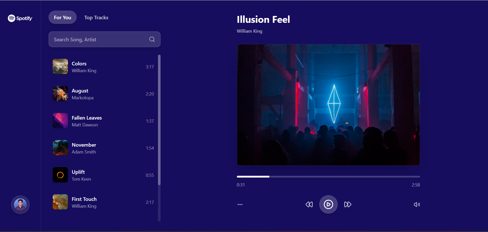
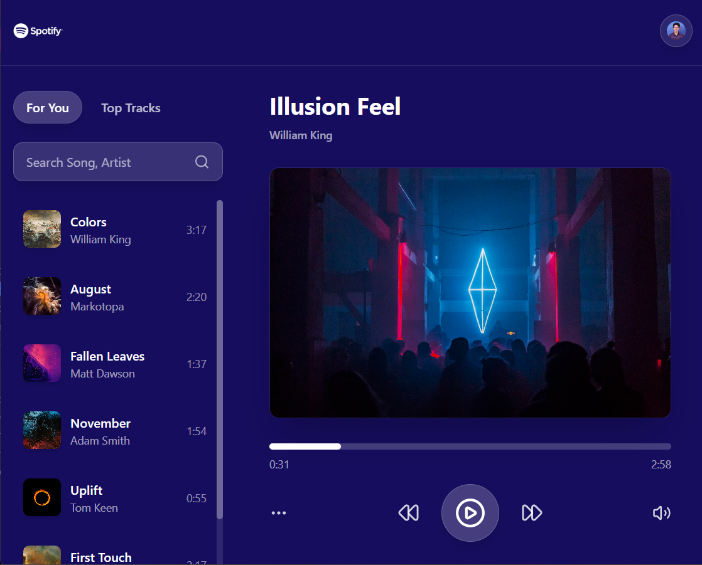
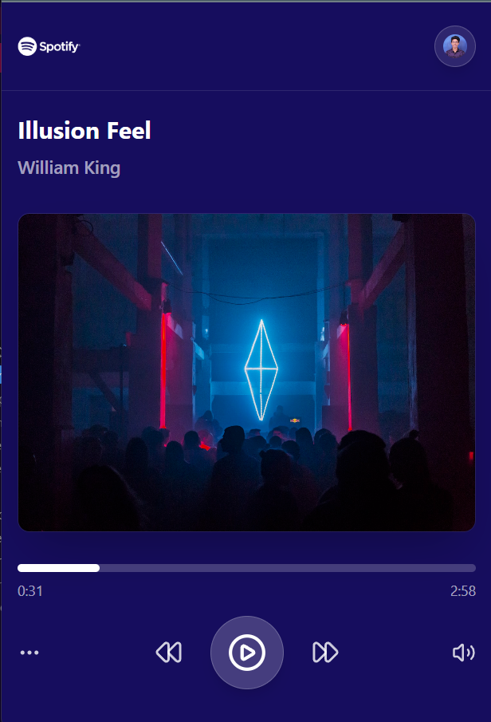
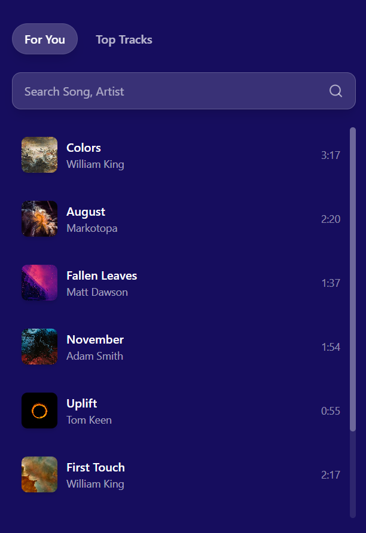

# 🎵 Spotify-Style Music Player

A modern, responsive music player built with React, TypeScript, and Tailwind CSS. This application provides a Spotify-like experience with smooth animations, dynamic theming, and comprehensive audio controls.

### Desktop Preview


### Tablet Preview


### Phone Preview



## ✨ Features

### 🔍 **Smart Search & Navigation**
- **Real-time Search**: Search songs by title or artist with debounced input for optimal performance
- **Tab System**: Switch between "For You" and "Top Tracks" playlists
- **Instant Filtering**: Songs filter dynamically as you type

### 🎨 **Dynamic Visual Experience**
- **Smooth Background Transitions**: Background color changes dynamically based on the current song's accent color
- **Responsive Design**: Seamlessly adapts to mobile, tablet, and desktop screens
- **Modern UI**: Clean, Spotify-inspired interface with smooth hover effects and animations

### 🎧 **Complete Audio Controls**
- **Play/Pause**: Toggle playback with visual feedback
- **Next/Previous**: Navigate through songs in the playlist
- **Volume Control**: Adjust volume with mute/unmute functionality
- **Progress Seeker**: Click or drag to jump to any position in the song
- **Real-time Updates**: Current time and duration display with live progress tracking

### 💾 **Smart State Management**
- **Persistent Playback**: Automatically saves and restores the last played song using localStorage
- **Context-based State**: Efficient state management using React Context API
- **Optimized Performance**: Song durations are cached to prevent redundant API calls

### 📱 **Responsive Layout**
- **Mobile-First Design**: Optimized layout for all screen sizes
- **Flexible Grid System**: Adaptive sidebar, music list, and player layout
- **Touch-Friendly**: Mobile-optimized controls and interactions

### 🎯 **Additional Features**
- **Loading States**: Smooth loading animations while fetching data
- **Song Duration Caching**: Prevents re-fetching song metadata
- **Visual Song Selection**: Currently playing song is highlighted
- **Professional Animations**: Subtle transitions and micro-interactions throughout the app

## 🛠️ Technologies Used

- **React 19.1.0** - Modern React with latest features
- **TypeScript** - Type-safe development
- **Tailwind CSS 4.1.11** - Utility-first styling with smooth animations
- **Vite** - Lightning-fast build tool
- **Lucide React** - Beautiful, customizable icons
- **Custom Hooks** - Debounced search and optimized performance

## 🚀 Getting Started

### Prerequisites
- Node.js (v16 or higher)
- npm or yarn

### Installation

1. **Clone the repository**
   ```bash
   git clone <repository-url>
   cd music-player-spotify
   ```

2. **Install dependencies**
   ```bash
   npm install
   ```

3. **Start the development server**
   ```bash
   npm run dev
   ```

4. **Open your browser**
   Navigate to `http://localhost:5173`

### Build for Production

```bash
npm run build
```

## 📁 Project Structure

```
src/
├── components/           # React components
│   ├── AudioPlayer.tsx  # Main audio player with controls
│   ├── MusicList.tsx    # Song list with search and tabs
│   └── Sidebar.tsx      # Navigation sidebar
├── context/             # React Context providers
│   ├── AudioPlayerContext.tsx  # Audio state management
│   └── SongsDataContext.tsx    # Songs data management
├── hooks/               # Custom React hooks
│   └── useDebounce.ts   # Debounced input hook
├── types/               # TypeScript type definitions
│   └── types.ts         # Song and application types
├── utils/               # Utility functions
│   └── formatDuration.ts # Time formatting utilities
└── assets/              # Static assets
```

## 🎯 Key Components

### AudioPlayer
- **Comprehensive Controls**: Play, pause, next, previous, volume, and seek
- **Dynamic Theming**: Background adapts to current song's accent color
- **Progress Tracking**: Visual progress bar with drag-to-seek functionality
- **Responsive Layout**: Optimal display across all devices

### MusicList
- **Search Functionality**: Real-time filtering with debounced input
- **Tab Navigation**: Switch between different playlists
- **Song Selection**: Click to play with visual feedback
- **Smooth Animations**: Hover effects and transition animations

### Context Management
- **AudioPlayerContext**: Manages current song, navigation, and localStorage persistence
- **SongsDataContext**: Handles song data fetching and duration caching

## 🎨 Styling Features

- **CSS Transitions**: Smooth background color transitions between songs
- **Responsive Breakpoints**: Mobile-first design with lg/md/sm breakpoints
- **Glass Morphism Effects**: Modern backdrop blur effects on interactive elements
- **Dynamic Colors**: Background colors change based on song metadata
- **Hover Animations**: Subtle scale and color transitions on interactive elements

## 🔧 Development

### Available Scripts

- `npm run dev` - Start development server
- `npm run build` - Build for production
- `npm run lint` - Run ESLint
- `npm run preview` - Preview production build

### Code Quality
- ESLint configuration for React and TypeScript
- Consistent code formatting
- Type-safe development with TypeScript

## 🌟 Performance Optimizations

- **Debounced Search**: Optimized search input to prevent excessive API calls
- **Duration Caching**: Song durations are cached in context to avoid redundant metadata fetching
- **localStorage Integration**: Persistent state without server dependency

## 📄 License

This project is open source and available under the [MIT License](LICENSE).

---

**Built with ❤️ using React, TypeScript, and Tailwind CSS**
